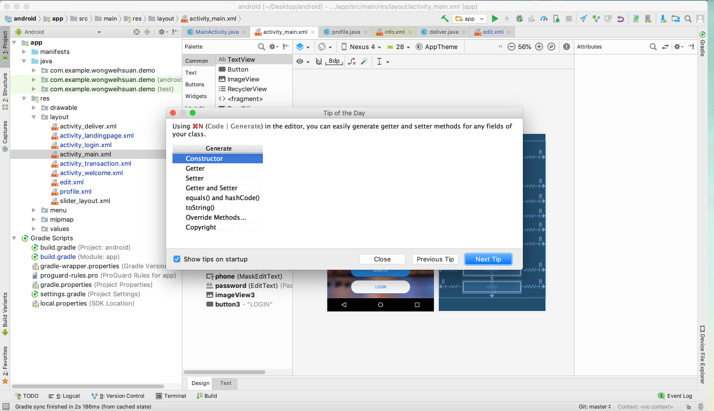

# android_vatm

Using Android Studio with Java to develop Android app which name is Vatm. This Android app is going to save users' time to get the cash back. Users order some food by using app and link to vatm when they check out. Users can choose the amount of cash back they prefer. Cash back will be delivered with food then. 

## Getting Started

This is the front-end part of the Vatm. Thus, please download android studio first and run it on simulator.

### Prerequisites

1.Android Studio

### Installing

1. Download Android Studio
https://developer.android.com/studio

## Running the tests

Since it is going to send http request to the server, I need to turn on the server so the user can run the test.
Or the user can download another repository which name is [android_vatm_backend](https://github.com/Wesley16838/android_vatm_backend) and run it on localhost:3000

### Features

1. Sign up (post http request)
2. Log in (post and get http request)
3. Track order (get http request)
4. Place the order (post http request)
5. Get the order (put http request)

## Authors

* **Wei-Hsuan Wong** - *Initial work* - [Wesley16838](https://github.com/Wesley16838/)

